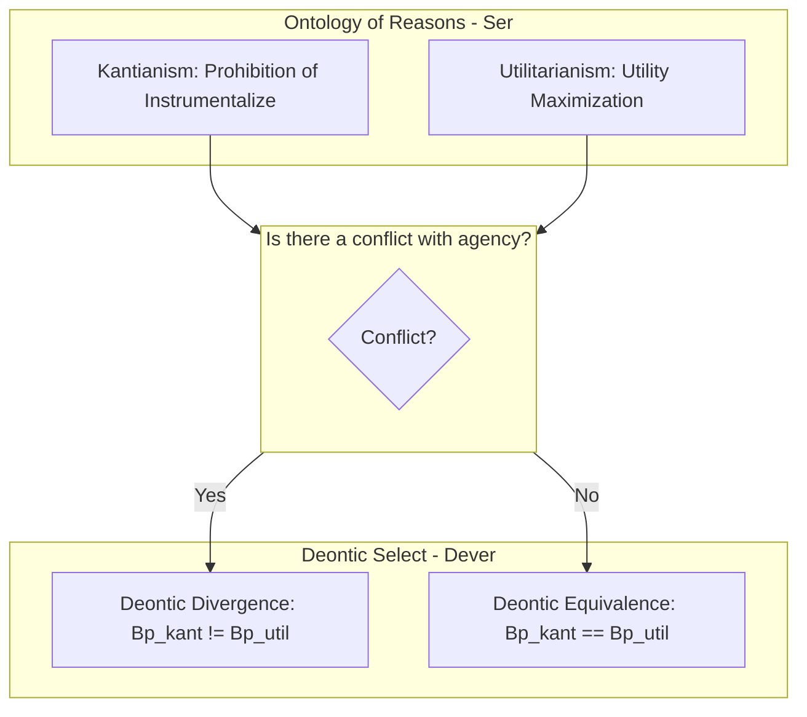

# Specification: Symmetrical Kant-Utilitarian Confrontation & Interactive Ethics Dashboard

This specification defines the formalization, implementation, and verification of the metatheoretical confrontation between **Kantian Deontology** and **Rule Utilitarianism** within the Universal Normative Core (UNC) framework. Additionally, it specifies the architectural requirements for an interactive web-based ethical dashboard (`docs/dashboard.html`) to visualize and simulate these convergence results.

---

## 1. Overview & Philosophical Foundations

The **Universal Normative Core (UNC)** framework separates the ontology of reasons from deontic action-selection. This enables us to model a core philosophical thesis: **diametrically opposed justificatory systems can converge on identical action-level obligations**.

We formalize two major traditions of Western ethics:
1.  **Kantianism ($p_{kant}$):** Grounded in the absolute prohibition against treating rational agents as mere means (instrumentalization).
2.  **Rule Utilitarianism ($p_{util}$):** Grounded in the maximization of aggregated qualitative welfare/utility.

Under normal conditions where maximizing welfare does not require the instrumentalization of any agent (the "No Conflict" or "Practical Convergence" scenario), we prove that the Kantian and Rule Utilitarian perspectives select identical sets of optimal worlds, achieving **Deontic Equivalence** ($B_{p\_kant}(w) = B_{p\_util}(w)$).

### Architecture Diagram

```text
               +------------------------------------------------+
               |           Ontology of Reasons (Ser)            |
               |  - Kantianism: Prohibition of Instrumentalize  |
               |  - Utilitarianism: Utility Maximization        |
               +-----------------------+------------------------+
                                       |
                     Is there a conflict with agency?
                                       |
                   +-------------------+-------------------+
                   | Yes                                   | No
                   v                                       v
        +----------------------+                +----------------------+
        |  Deontic Divergence  |                |  Deontic Equivalence |
        |  Bp_kant != Bp_util  |                |   Bp_kant == Bp_util |
        +----------------------+                +----------------------+
```



---

## 2. Functional Requirements

### 2.1 Isabelle/HOL Formalization (`UNC_Confrontation.thy`)
-   **Perspectives:** Declare two primitive perspectives `p_kant :: p` and `p_util :: p`.
-   **Utility:** Declare `UtilityMax :: "act \<Rightarrow> i \<Rightarrow> bool"` representing whether an action maximizes aggregate qualitative welfare in a given world.
-   **Kantian Prohibitions:** Declare `Instrumentalize :: "a \<Rightarrow> \<sigma>"` and `ExecAssert :: "a \<Rightarrow> \<sigma> \<Rightarrow> \<sigma>"` to represent treating agents as mere means.
-   **Axiom (Kantian):** Formalize that treating an agent as a mere means is prohibited (cannot be an optimal action):
    `\<forall>x y act w. ExecAssert x (Instrumentalize y) w \<longrightarrow> \<not>OptimalAct p_kant x act w`
-   **Axiom (Utilitarian):** Formalize that Rule Utilitarianism selects actions that maximize utility:
    `\<forall>x act w. OptimalAct p_util x act w \<longleftrightarrow> UtilityMax act w`
-   **Scenario Definition:** Define the convergence scenario (`NoConflict w`) where utility-maximizing actions do not involve instrumentalization:
    `NoConflict w \<equiv> \<forall>x act. UtilityMax act w \<longleftrightarrow> \<not>(\<exists>y. ExecAssert x (Instrumentalize y) w)`
-   **Theorem:** Prove **Practical Convergence**: Under `NoConflict w`, `B p_kant w = B p_util w`, resulting in perfect `DeonticEquiv p_kant p_util`.
-   **Validation:** Verify model satisfiability using `nitpick`.

### 2.2 Lean 4 Formalization (`UNC/Confrontation.lean`)
-   Mirror the Isabelle/HOL definitions, axioms, and proofs symmetrically inside the Lean 4 type-checker.
-   Integrate the module into `Main.lean` and ensure compilation with `lake build`.

### 2.3 Interactive Web-Based Ethical Dashboard (`docs/dashboard.html`)
To make the framework visual, shareable, and practical, build a single-page interactive application using HTML5, CSS3, and Vanilla JavaScript.
-   **Theme:** Aesthetic dark-glow design with high-contrast accent borders.
-   **Scenarios:**
    1.  **Autonomous Car Collision:** Steer and sacrifice 1 pedestrian to save 5 passengers, or continue straight (preserving agency/non-instrumentalization).
    2.  **Pandemic Data Surveillance:** Track private citizen locations without consent to maximize public health utility, or prohibit to protect agency.
-   **Interactivity:**
    -   Select scenario.
    -   Select active metaethical perspective (Realism, Gewirth/PGC, Apel/Discourse, Kantianism, Utilitarianism).
    -   Dynamically display:
        -   **Ontological Level:** The justifications and internal axioms of the selected theory.
        -   **Bridge Level:** Galois connections, performative contradictions, or generic rights.
        -   **Deontic Output:** The recommended action (Ought).
    -   **Bisimulation Simulator:** Run two perspectives in parallel, configure world-parameters (e.g., presence/absence of conflict), and visualize where they are bisimilar (deontically equivalent) at the action level.

---

## 3. Non-Functional Requirements
-   **Symmetry:** Exact equivalence between Isabelle and Lean proofs.
-   **Performance:** Lean compilation under 5 seconds; HTML file is lightweight (no external frameworks, CSS/JS bundled).
-   **No Placeholders:** Zero `sorry` or `oops` in active compilation paths.

---

## 4. Acceptance Criteria
1.  `UNC_Confrontation.thy` is registered in `UNC/ROOT` and verified successfully.
2.  `UNC/Confrontation.lean` is integrated into `Main.lean` and builds with `lake build`.
3.  `docs/dashboard.html` is created and fully operational.
4.  Track is marked as `completed` in `metadata.json`.
