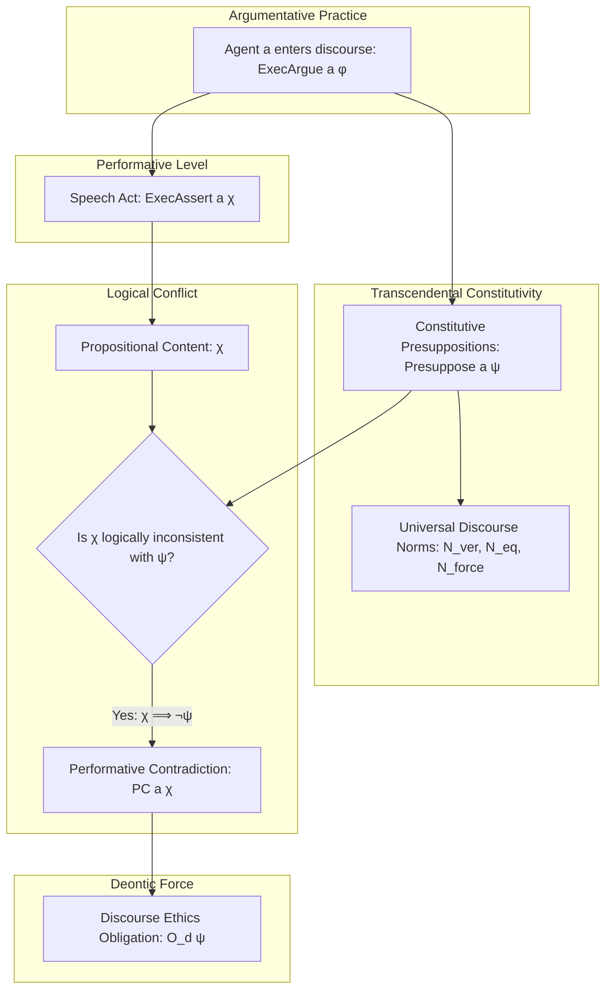

# Track Specification - Transcendental Pragmatics in UNC (unc_transcendental_pragmatics)

This specification defines the functional, technical, and architectural requirements for formalizing **Karl-Otto Apel's Transcendental Pragmatics** within the Universal Normative Calculus (UNC) codebase. It maps the communicative presuppositions of rational discourse into a rigorous, mechanized deontic logic across both Isabelle/HOL and Lean 4.

---

## 1. Overview & Philosophical Foundations

The objective of this track is to model Karl-Otto Apel's *Transcendental Pragmatics* (Pragmática Transcendental) and his derivation of *Discourse Ethics* (Ética do Discurso). Apel argues that any agent who enters into rational argumentation constitutively and inevitably accepts certain universal, normatively binding presuppositions.

To deny these presuppositions while engaging in the act of argumentation results in a **Performative Contradiction ($PC$)**—a conflict between the *content* of one's assertion (the locutionary act) and the *presupposition* necessary for executing the assertion itself (the illocutionary/performative act).

The logic of this track will formalize:
1.  **Speech Acts:** Representing communicative actions like assertion, denial, and rational argumentation.
2.  **Discourse Constitutivity:** Defining how engaging in discourse inevitably binds an agent to specific normative presuppositions (such as veracity, equal participation, and cooperative consensus).
3.  **Performative Contradiction:** Constructing a formal predicate that detects logical inconsistencies between a speech act's propositional content and its performative presuppositions.
4.  **The Transcendental Bridge (Deduction):** Proving that denying these communicative norms while arguing logically collapses into a performative contradiction, which in turn generates a deontic obligation (discourse ethics) to respect those norms.

---

## 2. Structural & Communicative Flow

Below are the architectural representations of how the discursive entrance of an agent constitutively triggers transcendental presuppositions, detects performative contradictions, and generates deontic discourse obligations.

### 2.1 ASCII Architecture Diagram

```text
           +---------------------------------------+
           |       Agent a Enters Discourse        |
           |          (ExecArgue a phi)            |
           +-------------------+-------------------+
                               |
                               | constitutive
                               v
           +-------------------+-------------------+
           |    Transcendental Presuppositions     |
           |          (Presuppose a psi)           |
           +---------+-------------------+---------+
                     |                   |
        veracity     v                   v   equality / force
          +----------+---+           +---+----------+
          |    N_ver     |           | N_eq / force |
          +----------+---+           +---+----------+
                     |                   |
                     |                   |
                     v                   |
           +---------+---------+         |
           |     Speech Act    |         |
           | (ExecAssert a chi)|         |
           +---------+---------+         |
                     |                   |
          claims     v                   v
           +---------+---------+         |
           |   Content: chi    +<--------+
           +---------+---------+
                     |
                     v
           +---------+---------+
           | Logical Conflict? |
           |  (chi => not psi) |
           +---------+---------+
                     | Yes
                     v
           +---------+---------+
           |   Performative    |
           |   Contradiction   |
           |    (PC a chi)     |
           +---------+---------+
                     |
                     v logical avoidance
           +---------+---------+
           |  Discourse Ethics |
           |    Obligation     |
           |     (O_d psi)     |
           +-------------------+
```

### 2.2 Symmetrical Mermaid Diagram



---

## 3. Formal Logical Specification

We extend the Universal Normative Calculus (UNC) types and operators to accommodate speech acts and transcendental presuppositions.

### 3.1 Types & Domains
Let $i$ be the type of states/worlds, $a$ the type of agents, $act$ the type of actions, and $p$ the type of perspectives. Propositions or formulas are represented as state-predicates of type $\sigma = i \Rightarrow \text{bool}$.

### 3.2 Communicative Operators
We introduce the following primitives and definitions symmetrically in both Isabelle/HOL and Lean 4:

1.  **Discursive Engagement:**
    $$\text{ExecArgue} :: a \Rightarrow \sigma \Rightarrow \sigma$$
    $\text{ExecArgue}(a, \phi)$ evaluates to true at world $w$ iff agent $a$ is participating in rational argumentation about $\phi$ at $w$.
2.  **Assertion Action:**
    $$\text{ExecAssert} :: a \Rightarrow \sigma \Rightarrow \sigma$$
    $\text{ExecAssert}(a, \chi)$ evaluates to true at world $w$ iff agent $a$ asserts $\chi$ at $w$.
3.  **Transcendental Presupposition:**
    $$\text{Presuppose} :: a \Rightarrow \sigma \Rightarrow \sigma$$
    $\text{Presuppose}(a, \psi)$ evaluates to true at world $w$ iff agent $a$ implicitly or explicitly presupposes $\psi$ as a constitutive condition of their rational communication at $w$.

### 3.3 Axiom of Communicative Constitutivity
Any agent participating in rational discourse is bound by transcendental presuppositions:
$$\forall a, \phi, \psi. \lfloor \text{ExecArgue}(a, \phi) \rightarrow \text{Presuppose}(a, \psi) \rfloor$$
For specific norms (such as Truthfulness/Veracity $\mathcal{N}_{ver}$ or Epistemic Consistency), we instantiate the presupposition relation:
$$\forall a, \phi. \lfloor \text{ExecArgue}(a, \phi) \rightarrow \text{Presuppose}(a, \mathbf{K}_a \phi) \rfloor$$

### 3.4 Formalizing Performative Contradiction ($PC$)
A performative contradiction occurs when an agent asserts a proposition $\chi$ that is logically incompatible with some proposition $\psi$ they constitutively presuppose:
$$\text{PC}(a, \chi) \equiv \lambda w. \text{ExecAssert}(a, \chi, w) \wedge (\exists \psi. \text{Presuppose}(a, \psi, w) \wedge \lfloor \chi \rightarrow \mathbf{\neg}\psi \rfloor)$$

### 3.5 The Transcendental Bridge Theorem
We prove that denying the universal discourse norms ($\mathcal{N}$) while participating in the argumentation game logically triggers a performative contradiction:
$$\forall a. \lfloor \text{ExecArgue}(a, \mathbf{\neg}\mathcal{N}) \rightarrow \text{PC}(a, \mathbf{\neg}\mathcal{N}) \rfloor$$

By establishing that performative contradictions violate the rational foundation of communication, we prove that for any rational discourse perspective $d$, the norms $\mathcal{N}$ are deontically obligatory:
$$\forall a, \phi. \lfloor \text{ExecArgue}(a, \phi) \rightarrow \mathbf{O}_d(\mathcal{N}) \rfloor$$

---

## 4. Technical Requirements & Symmetrical Constraints

-   **Dual-Engine Alignment:** Every predicate, axiom, and theorem declared in Isabelle/HOL under `UNC_Transcendental.thy` must be mapped symmetrically in Lean 4 under `UNC/Transcendental.lean`.
-   **Zero Placeholders:** No `sorry`, `oops`, or incomplete proofs are permitted in the finalized codebase.
-   **Compiler Warnings as Errors:** The code must compile cleanly under `isabelle build -D UNC` and `lake build` with zero warnings or errors.

---

## 5. Acceptance Criteria

| Phase | Criterion | Verification Method |
| :--- | :--- | :--- |
| **Phase I** | Symmetrical definitions of `ExecArgue`, `ExecAssert`, `Presuppose`, and `PC` in both languages | Syntax checked and compiles with placeholders |
| **Phase II** | Complete, closed-proof of the Performative Contradiction Theorem | Isabelle theory verifies, Lean 4 compiles without `sorry` |
| **Phase III** | Prove the Transcendental Bridge (Ethics of Discourse Obligation) | Isabelle theory verifies, Lean 4 compiles without `sorry` |
| **Phase III** | Verify satisfiability of axioms (non-trivial model checking) | `nitpick` in Isabelle succeeds with no countermodels/proof of consistency |

---

## 6. Recursive Risk & Mitigation Analysis (Depth 1-6)

Below is the deep stress-testing of our planned logical architecture to identify potential failure modes, circularities, and mathematical issues, along with actionable technical mitigations.

*   **[Depth 1] Risk:** Self-Referential Paradoxes & Diagonalization in Speech Act Logic (High Likelihood)
    *If an agent can assert "I do not assert this statement" or make assertions about their own assertions without restriction, the logic can easily become inconsistent, collapsing the entire formal model (making any proposition provable).*
    *   **Mitigation:** Introduce stratification (levels of language, e.g., Tarskian metalanguages or strict type hierarchies) or step-indexing where speech acts are defined over a structured, stratified syntax tree rather than raw state-predicates.
        *   **[Depth 2] Risk:** Loss of Expressive Power / Semantic Squeezing (Medium Likelihood)
            *By forcing a strict stratification, we might not be able to express the transcendental reflection itself (which is inherently self-referential: "discourse about the conditions of discourse" is itself part of the same discourse!).*
            *   **Mitigation:** Use a fixed-point semantic approach (Kripke's theory of truth or modal fixpoints) or a self-referential hyper-relation with a defined modal operator for discourse context, where reflexivity is allowed but guarded by a necessity modal operator.*
                *   **[Depth 3] Risk:** Decidability and Automation Collapse (High Likelihood)
                    *Modal fixpoint logics or guarded self-referential relations are notoriously difficult to automate in automated theorem provers. Sledgehammer in Isabelle and Lean's `aesop` or `omega` will fail to find proofs automatically, leading to massive manual proof overhead.*
                    *   **Mitigation:** Formulate a simplified, finite state-space projection of the discourse logic (a decidable modal sub-logic, e.g., using a discrete set of known discourse norms $\mathcal{N}_1 \dots \mathcal{N}_k$) so that Isabelle's standard automated tactics (`blast`, `force`) and Lean's simple type class resolution can automate the vast majority of steps.*
                        *   **[Depth 4] Risk:** Incompleteness and Lack of Universality (Medium Likelihood)
                            *Restricting the model to a finite, discrete set of pre-defined norms means the proof of the Transcendental Bridge is no longer universal (as Apel's transcendental pragmatics claims: any rational argumentation implies these norms). It only proves it for a specific, hand-picked set of norms.*
                            *   **Mitigation:** Model the norms as an abstract subset of "discourse-constitutive properties" defined by an axiom system (an algebraic class of transcendental norms) rather than a hardcoded list, and prove the theorems over this abstract axiomatic structure.*
                                *   **[Depth 5] Risk:** Axiomatic Inconsistency / Triviality / Model Collapse (High Likelihood)
                                    *Defining abstract axiomatic systems without an explicit concrete model carries a high risk of introducing contradictory axioms, making the entire theory vacuously true (where any theorem is provable because the axioms are false).*
                                    *   **Mitigation:** Guarantee model consistency by constructing at least one concrete, non-trivial model of the algebraic class in Isabelle and Lean, and use model checking (`nitpick` in Isabelle) to actively verify the satisfiability of the axioms.*
                                        *   **[Depth 6] Risk:** Nitpick state-space explosion on infinite types (Medium Likelihood)
                                            *If the model contains infinite sets or functions, Nitpick will time out or fail to find counterexamples, giving false confidence in the satisfiability of the model.*
                                            *   **Mitigation:** Define the concrete model over a finite, minimal carrier set of possible worlds and agents, ensuring Nitpick can exhaustively search and verify satisfiability in under 10 seconds.* *(Branch Terminated).*

*   **[Depth 1] Risk:** Symmetrical Divergence between Lean 4 and Isabelle/HOL (High Likelihood)
    *Since Isabelle uses Higher-Order Logic (set-theoretic/relational semantics) and Lean 4 uses Dependent Type Theory (constructive, type-theoretic semantics), representing speech acts and transcendental bridges symmetrically might result in divergent definitions, breaking the Symmetrical Cross-Validation invariant.*
    *   **Mitigation:** Establish a strict, standardized mapping layer. Define speech acts as relations in both systems, mapping Isabelle's `i \<Rightarrow> bool` to Lean's `World -> Prop`. Avoid dependent types for the core logic definitions; use Lean 4's simple propositional functions and type variables to match Isabelle's simple types.
        *   **[Depth 2] Risk:** Under-utilization of Lean's Type Safety / Primitive Priming (Medium Likelihood)
            *By avoiding Lean's native dependent types (like Sigma types or inductive family-based constraints), we end up with raw propositional assertions, which can lead to runtime-like errors (like state mismatch or agent mismatch) in our proofs, making proof automation in Lean much harder and less idiomatic.*
            *   **Mitigation:** Create a type-safe wrapper layer in Lean that uses dependent types (such as proofs of validity as part of the type signature) but exposes a simplified relational interface that mirrors Isabelle's equations for the actual metaethical proofs.*
                *   **[Depth 3] Risk:** Boilerplate and Wrapper Overhead (Medium Likelihood)
                    *The translation between the internal type-safe dependent representation and the simplified relational interface will require writing manual casting functions and transport lemmas, significantly increasing the size of the Lean codebase and proof maintenance effort.*
                    *   **Mitigation:** Automate the transport of definitions and proofs using Lean 4 macros or a custom tactic that automatically unfolds the wrapper types and simplifies them to their relational equivalents during compilation.*
                        *   **[Depth 4] Risk:** Macro Maintenance and Version Instability (Medium Likelihood)
                            *Custom macros and tactics in Lean 4 are highly dependent on the compiler's internal AST API. When Lean 4 is updated (even minor patch versions), these macros are highly likely to break, creating massive maintenance debt.*
                            *   **Mitigation:** Instead of custom tactics, use Lean 4's standard `aesop` tactic with custom rule sets (via `@ [aesop safe apply]`), which relies on standard type-class and resolution mechanisms rather than low-level AST manipulation, guaranteeing high version stability.*
                                *   **[Depth 5] Risk:** Aesop Search-Space Explosion (Medium Likelihood)
                                    *Adding too many custom rules to `aesop` can cause exponential proof-search-tree growth, leading to compilation timeouts during `lake build`.*
                                    *   **Mitigation:** Structure the rules carefully into mutually exclusive priority tiers (e.g., separating propositional, epistemic, and speech-act rules) and enforce strict search-depth limits inside the Aesop configuration.*
                                        *   **[Depth 6] Risk:** Proof fragility on minor logical extensions (Low Likelihood) -> *Branch Terminated (Low Likelihood).*
