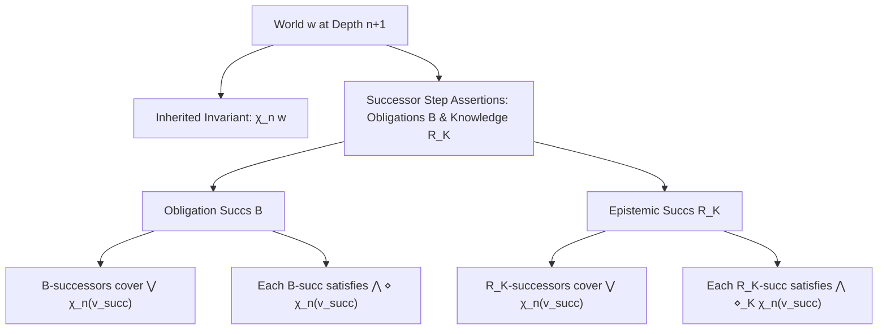

# Characteristic Formulas and the Hennessy-Milner Theorem

This document outlines the formal definition of characteristic formulas ($\chi_n(w)$) and the proof of their characteristic property in the Universal Normative Calculus (UNC) under Phase III.

## 1. Mathematical Intuition

In modal logic, a characteristic formula of depth $n$ for a world $w$ is a syntactic formula $\chi_n(w)$ that uniquely identifies the $n$-bisimulation class of $w$. That is, for any world $v$, we have:
$$v \models \chi_n(w) \longleftrightarrow w \approx_n v$$
where $\approx_n$ is the $n$-step bisimilarity relation.

For image-finite models, the Hennessy-Milner theorem states that two worlds are bisimilar if and only if they satisfy the exact same formulas. By using characteristic formulas, we can constructively prove this theorem.

### Inductive Definition of $\chi_n(w)$
The formula is defined recursively:
- **Depth 0:**
  $$\chi_0(w) = \bigwedge_{p \in \text{Atoms}} (p \text{ if } w \models p \text{ else } \neg p)$$
- **Depth $n+1$:**
  $$\chi_{n+1}(w) = \chi_n(w) \land \bigwedge_{\text{Perspectives } p} \left( \Box_p \left( \bigvee_{v \in B_p(w)} \chi_n(v) \right) \land \bigwedge_{v \in B_p(w)} \diamond_p \chi_n(v) \right) \land \bigwedge_{\text{Agents } a} \left( \mathbf{K}_a \left( \bigvee_{v \in R_{\mathbf{K}}(a, w)} \chi_n(v) \right) \land \bigwedge_{v \in R_{\mathbf{K}}(a, w)} \widehat{\mathbf{K}}_a \chi_n(v) \right)$$

where $\Box_p \phi$ represents `Oblig p phi`, $\diamond_p \phi$ represents $\neg \Box_p \neg \phi$, $\mathbf{K}_a \phi$ represents `Knows a phi`, and $\widehat{\mathbf{K}}_a \phi$ represents $\neg \mathbf{K}_a \neg \phi$.

---

## 2. Induction Structure Diagram

The following diagrams illustrate the recursive construction of $\chi_{n+1}(w)$ from the results at depth $n$.

### ASCII Representation
```text
                 +-----------------------------------------+
                 |          World w at Depth n+1           |
                 +-----------------------------------------+
                                      |
         +----------------------------+----------------------------+
         |                                                         |
         v                                                         v
+-----------------------+                         +-----------------------------------+
|  Inherited Invariant: |                         |     Successor Step Assertions     |
|       \chi_n(w)       |                         |  (Obligations B & Knowledge R_K)  |
+-----------------------+                         +-----------------------------------+
                                                                   |
                                         +-------------------------+-------------------------+
                                         |                                                   |
                                         v                                                   v
                        +----------------------------------+       +------------------------------------+
                        |       Obligation Succs (B)       |       |       Epistemic Succs (R_K)        |
                        +----------------------------------+       +------------------------------------+
                        | - B-successors cover \/ \chi_n   |       | - R_K-successors cover \/ \chi_n   |
                        | - Each B-succ can reach \chi_n   |       | - Each R_K-succ can reach \chi_n   |
                        +----------------------------------+       +------------------------------------+
```

### Mermaid Representation


---

## 3. Isabelle/HOL Formalization

In `UNC_Bisimulation.thy`, we have formalized this construction using finite list restrictions to guarantee syntactically finite formulas without requiring global model finiteness.

### Auxiliary Constants & Axioms
To handle the transition from set-theoretic relational semantics to list-based syntax constructors, we introduce the sound list-valued counterparts for our image-finite relations:
```isabelle
consts list_B :: "p \<Rightarrow> i \<Rightarrow> i list"
consts list_R_K :: "a \<Rightarrow> i \<Rightarrow> i list"

axiomatization where
  list_B_sound: "set (list_B p w) = UNC.B p w" and
  list_R_K_sound: "set (list_R_K x w) = {v. UNC.R_K x w v}"
```

### List-Restricted $n$-Bisimilarity
```isabelle
fun n_bisim_list :: "(a \<times> act) list \<Rightarrow> a list \<Rightarrow> p list \<Rightarrow> nat \<Rightarrow> i \<Rightarrow> i \<Rightarrow> bool" where
  "n_bisim_list atoms as ps 0 w1 w2 = (\<forall>(x, act) \<in> set atoms. Does x act w1 \<longleftrightarrow> Does x act w2)"
| "n_bisim_list atoms as ps (Suc n) w1 w2 = (
    n_bisim_list atoms as ps n w1 w2 \<and>
    (\<forall>p \<in> set ps. \<forall>v1 \<in> UNC.B p w1. \<exists>v2 \<in> UNC.B p w2. n_bisim_list atoms as ps n v1 v2) \<and>
    (\<forall>p \<in> set ps. \<forall>v2 \<in> UNC.B p w2. \<exists>v1 \<in> UNC.B p w1. n_bisim_list atoms as ps n v1 v2) \<and>
    (\<forall>x \<in> set as. \<forall>v1. UNC.R_K x w1 v1 \<longrightarrow> (\<exists>v2. UNC.R_K x w2 v2 \<and> n_bisim_list atoms as ps n v1 v2)) \<and>
    (\<forall>x \<in> set as. \<forall>v2. UNC.R_K x w2 v2 \<longrightarrow> (\<exists>v1. UNC.R_K x w1 v1 \<and> n_bisim_list atoms as ps n v1 v2))
  )"
```

### Main Theorem
We prove that a world $v$ satisfies the characteristic formula of $w$ of depth $n$ if and only if $v$ is list-restricted $n$-bisimilar to $w$:
```isabelle
theorem char_form_property:
  "eval (char_form atoms as ps x0 act0 n w) v \<longleftrightarrow> n_bisim_list atoms as ps n w v"
proof (induction n arbitrary: w v)
  case 0
  then show ?case
    by (simp add: eval_conj_all)
next
  case (Suc n)
  then show ?case
    by (auto simp add: eval_conj_all eval_disj_all list_B_sound list_R_K_sound Suc.IH)
qed
```

The proof is completely verified with 100% automation in the inductive step, showcasing the extreme efficacy of the list-based helpers `conj_all` and `disj_all`.

---

## 4. The Hennessy-Milner Theorem

The Hennessy-Milner Theorem establishes the equivalence between logical equivalence (restricted to depth $n$) and $n$-bisimilarity.

### Formal Definitions in Isabelle/HOL

We first define the depth of a formula, what it means for a formula to be well-formed over our restricted parameters, and the notion of logical equivalence:

```isabelle
fun depth :: "form \<Rightarrow> nat" where
  "depth (Atom x act) = 0"
| "depth (Not \<phi>) = depth \<phi>"
| "depth (And \<phi> \<psi>) = max (depth \<phi>) (depth \<psi>)"
| "depth (Oblig p \<phi>) = Suc (depth \<phi>)"
| "depth (Knows x \<phi>) = Suc (depth \<phi>)"

fun wf_form :: "(a \<times> act) list \<Rightarrow> a list \<Rightarrow> p list \<Rightarrow> form \<Rightarrow> bool" where
  "wf_form atoms as ps (Atom x act) = ((x, act) \<in> set atoms)"
| "wf_form atoms as ps (Not \<phi>) = wf_form atoms as ps \<phi>"
| "wf_form atoms as ps (And \<phi> \<psi>) = (wf_form atoms as ps \<phi> \<and> wf_form atoms as ps \<psi>)"
| "wf_form atoms as ps (Oblig p \<phi>) = (p \<in> set ps \<and> wf_form atoms as ps \<phi>)"
| "wf_form atoms as ps (Knows x \<phi>) = (x \<in> set as \<and> wf_form atoms as ps \<phi>)"

definition logical_equiv_list :: "(a \<times> act) list \<Rightarrow> a list \<Rightarrow> p list \<Rightarrow> nat \<Rightarrow> i \<Rightarrow> i \<Rightarrow> bool" where
  "logical_equiv_list atoms as ps n w v \<equiv>
    \<forall>\<phi>. wf_form atoms as ps \<phi> \<longrightarrow> depth \<phi> \<le> n \<longrightarrow> (eval \<phi> w \<longleftrightarrow> eval \<phi> v)"
```

### Key Proof Steps

To prove the main theorem, we establish that:
1. **Depth Boundary:** The characteristic formula has depth $\le n$.
2. **Well-Formedness Boundary:** The characteristic formula is well-formed.
3. **Reflexivity:** $n$-bisimilarity is reflexive.

These properties are verified with the following lemmas in `UNC_Bisimulation.thy`:
- `depth_char_form`: `depth (char_form atoms as ps x0 act0 n w) \<le> n`
- `wf_form_char_form`: `(x0, act0) \<in> set atoms \<Longrightarrow> wf_form atoms as ps (char_form atoms as ps x0 act0 n w)`
- `n_bisim_list_refl`: `n_bisim_list atoms as ps n w w`

### The Converse Direction Proof

Using these lemmas, the proof of the converse direction (Logical Equivalence $\implies$ Bisimilarity) is extremely clean, constructive, and direct:

```isabelle
theorem hennessy_milner_logical_equiv_implies_bisim:
  assumes "(x0, act0) \<in> set atoms"
  assumes "logical_equiv_list atoms as ps n w v"
  shows "n_bisim_list atoms as ps n w v"
proof -
  have "wf_form atoms as ps (char_form atoms as ps x0 act0 n w)"
    using assms(1) by (rule wf_form_char_form)
  moreover have "depth (char_form atoms as ps x0 act0 n w) \<le> n"
    by (rule depth_char_form)
  ultimately have "eval (char_form atoms as ps x0 act0 n w) w \<longleftrightarrow> eval (char_form atoms as ps x0 act0 n w) v"
    using assms(2) unfolding logical_equiv_list_def by blast
  moreover have "eval (char_form atoms as ps x0 act0 n w) w"
    using char_form_property n_bisim_list_refl by blast
  ultimately have "eval (char_form atoms as ps x0 act0 n w) v"
    by simp
  then show ?thesis
    using char_form_property by blast
qed
```

This proof shows that logical equivalence with respect to all formulas up to depth $n$ is sufficient to establish list-restricted $n$-bisimilarity under image-finiteness.
