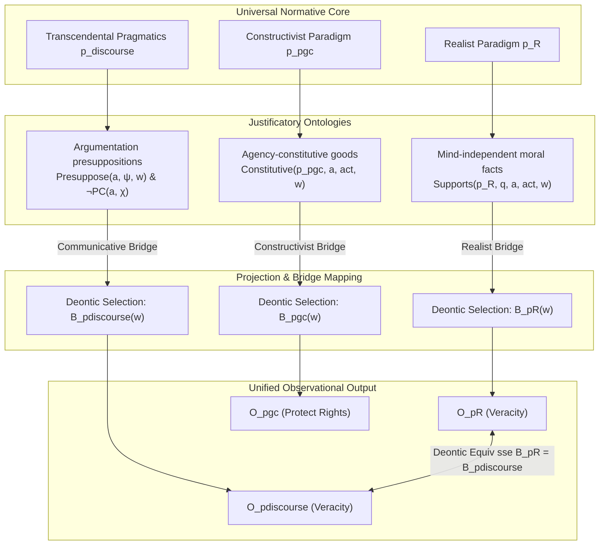

# Metaethical Translations & Paradigm Convergence in UNC

This document details how different metaethical positions—specifically **Gewirthian Constructivism** and **Apelian Transcendental Pragmatics**—are formalized, reconstructed, and translated within the Universal Normative Core (UNC). 

More importantly, it provides the metatheoretical synthesis showing **when, how, and under what conditions competing metaethical paradigms converge on the same deontic duties** despite having diametrically opposed metaphysical and ontological justifications.

---

## 1. The Two-Level Architecture of Metaethical Paradigms

A central discovery of UNC is that metaethical disagreement can be decomposed into a two-level structure:
1. **The Ontological/Justificatory Level (Ser):** How a paradigm $p$ explains and justifies the existence of a reason or a normative constraint.
2. **The Deontic/Projective Level (Dever):** The actual system of obligations, permissions, and optimal actions ($B_p(w)$) generated by that paradigm.

Compounding this is the thesis of **Deontic Equivalence under Ontological Incongruence** (demonstrated via Nitpick countermodels in `UNC.thy`):
$$\exists p_1, p_2. \neg \text{OntoEquiv}(p_1, p_2) \wedge \text{DeonticEquiv}(p_1, p_2)$$

This proves that two metaethical paradigms can disagree entirely on the nature and metaphysical origin of reasons (Ontology) while agreeing perfectly on the actions that agents ought to perform (Deontic output).

---

## 2. Paradigm 1: Alan Gewirth's Principle of Generic Consistency (Constructivism)

In Gewirth’s constructivism (`UNC_Gewirth.thy` and `Gewirth.lean`), the justifying reasons of an agent are grounded in the **constitutive preconditions of agency** (freedom and well-being):

1. **Constitutivity:** Any agent $x$ constitutively requires *freedom* and *well-being* (`FreedomAndWellBeing`) to perform any action whatsoever.
2. **Conclusiveness:** Because these conditions are constitutive requirements for action, $x$ has a *conclusive reason* to value and claim them.
3. **Universalization:** Since $x$ claims rights to freedom and well-being on the sole ground of being an agent, they must logically grant the same rights of freedom and well-being to all other agents (`Protect y`).
4. **Deontic Bridge:** Therefore, $x$ is morally obligated under the PGC perspective (`p_pgc`) to protect others:
   $$\forall x, y, w. \text{OptimalAct}(p_{pgc}, x, \text{Protect}(y), w)$$

---

## 3. Paradigm 2: Karl-Otto Apel's Transcendental Pragmatics (Communicative Pragmative-Transcendentalism)

In Apel’s transcendental pragmatics (`UNC_Pragmatics.thy` and `Pragmatics.lean`), the justifying reasons of an agent are grounded in the **constitutive presuppositions of communicative action (argumentation)**:

1. **Communicative Constitutivity:** Engaging in rational discourse (`ExecArgue a φ`) constitutively and inevitably forces an agent to presuppose universal discursive norms (`Presuppose a N_ver` and `Presuppose a N_eq`), such as truthfulness/veracity and symmetric participant equality.
2. **Performative Contradiction ($PC$):** Asserting a proposition $\chi$ (`ExecAssert a χ`) that is logically incompatible with these inescapable presuppositions $\psi$ commits a performative contradiction:
   $$\text{PC}(a, \chi) \equiv \lambda w. \text{ExecAssert}(a, \chi, w) \wedge (\exists \psi. \text{Presuppose}(a, \psi, w) \wedge \lfloor \chi \rightarrow \mathbf{\neg}\psi \rfloor)$$
3. **Transcendental Bridge (Deduction):** Any rational skeptic attempting to argue against discourse-ethical norms ($\neg N_{ver}$) falls into a performative contradiction:
   $$\forall a. \lfloor \text{ExecArgue}(a, \mathbf{\neg}N_{ver}) \rightarrow \text{PC}(a, \mathbf{\neg}N_{ver})\rfloor$$
4. **Deontic Output:** Under the discourse perspective (`p_discourse`), this performative self-defeat yields a universal communicative obligation:
   $$\forall a, \phi, w. \text{ExecArgue}(a, \phi, w) \rightarrow (\forall v \in B_{discourse}(w). N_{ver}(v))$$

---

## 4. The Metatheoretical Synthesis: Conditions for Paradigm Convergence

UNC acts as an translation engine to determine exactly **under what conditions two metaethical paradigms yield identical duties ($D_i(K) = D_j(K)$) given the justifying reasons under each agent's perspective.**

```text
               +-------------------------------------------------------+
               |             UNIVERSAL NORMATIVE CORE (UNC)            |
               +-------------------------------------------------------+
                                           |
         +---------------------------------+---------------------------------+
         |                                 |                                 |
         v                                 v                                 v
+-----------------------+       +-----------------------+       +-----------------------+
|  Realist Paradigm pR  |       | Constructivist p_pgc  |       | Transcendental p_dis  |
+-----------------------+       +-----------------------+       +-----------------------+
| - Justification:      |       | - Justification:      |       | - Justification:      |
|   Mind-independent    |       |   Constitutive of     |       |   Communicative       |
|   moral facts.        |       |   Agency (Gewirth)    |       |   presuppositions     |
|                       |       |                       |       |   and avoid PC (Apel) |
| - Internal Relation:  |       | - Internal Relation:  |       | - Internal Relation:  |
|   Supports pR q a act |       |   Constitutive p_pgc  |       |   Presuppose a psi    |
+-----------+-----------+       +-----------+-----------+       +-----------+-----------+
            |                               |                               |
            |                               |                               |
            +-------------------------------+-------------------------------+
                                            |
                                            v  Transferred via Bridge Principles
                                +-----------------------+
                                |  Deontic Optimal set  |
                                |       B_p(w)          |
                                +-----------+-----------+
                                            |
                                            v  Yields
                                +-----------------------+
                                |    Deontic Output     |
                                |       O_p \phi        |
                                +-----------------------+
```



### 4.1 How and When Convergence Occurs
Paradigm convergence occurs if, and only if, the different justificatory ontologies map to the **same set of optimal worlds ($B_p(w)$)**. 

1. **The Realist Paradigm** ($p_R$) maps the fact that truthfulness is supported by an objective moral fact $q$ into the optimal worlds:
   $$\forall v \in B_{p_R}(w). N_{ver}(v)$$
2. **The Transcendental Pragmatist Paradigm** ($p_{discourse}$) maps the fact that the agent is currently arguing and cannot commit a performative contradiction into the optimal worlds:
   $$\forall v \in B_{discourse}(w). N_{ver}(v)$$

**The Condition for Deontic Identity:**
The duties of $p_R$ and $p_{discourse}$ are identical ($D_{p_R}(K) = D_{p_{discourse}}(K)$) if and only if:
$$\forall w. B_{p_R}(w) = B_{p_{discourse}}(w)$$

This identity is made possible because UNC's multimodal semantical structure separates the **justifying reasons under the perspective of each agent** (which are represented by `Supports`, `Constitutive`, or `Presuppose`) from the **deontic projection** (`B p w`). 

### 4.2 The Role of Normative Bisimulation in Paradigm Identity
Our proved **Normative Bisimulation Invariance** (Theorem A and Hennessy-Milner Theorem B/C) provides the exact mathematical characterization of this equivalence:

If two worlds $w_1$ (under a constructivist paradigm) and $w_2$ (under a transcendental-pragmatic paradigm) are related by a **Normative Observational Bisimulation** ($w_1 \sim_n w_2$), then:
1. They agree on all observable actions executed by the agents (`Does x act`).
2. They agree on all epistemic states of the agents (`Knows x`).
3. **They agree on all deonto-moral obligations (`Oblig p`).**

**Philosophical Consequence:**
An agent operating within the language of normativity cannot logically distinguish whether the authority of their moral obligations is grounded in the mind-independent facts of **Realism**, the agency-constitutive requirements of **Constructivism**, or the communication-constitutive constraints of **Transcendental Pragmatics**. 

If the observational structures are bisimilar, **the paradigms are logically and deontically indistinguishable**. The metatheory mathematically proves that the "clash" between these paradigms is purely metaphysical, not normative. Their duties are structurally and symmetrically the same, justified under each agent's internal perspective through different but bisimilar relational pathways.
