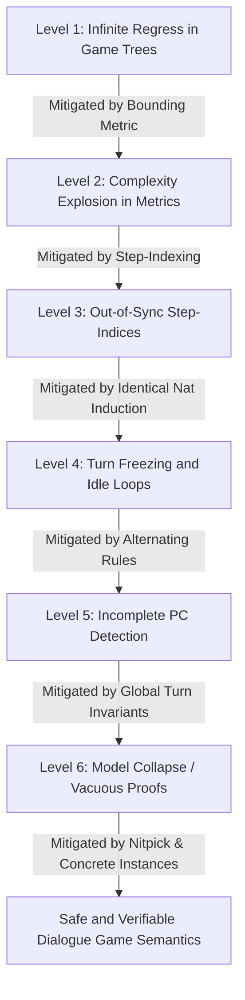

# Recursive Risk Analysis: Dialogical Logic and Game Trees (Track 3)

This document contains a 6-level deep recursive risk and mitigation analysis for the formalization and mechanical verification of dialogical logic, non-cooperative communication games, and skepticism defeat within the Universal Normative Core (UNC).

---

## Recursive Risk Tree

```text
Level 1: Unfounded Recursive Loops in Game Trees (Infinite Regress)
  └── Level 2: Complexity Explosion in Well-Founded Metric Tracking
        └── Level 3: Out-of-Sync Step-Indices (Isabelle vs. Lean 4 Symmetry)
              └── Level 4: Under-specification of Turn-taking (Freezing / Idle Loops)
                    └── Level 5: Incompleteness of Performative Contradiction Triggering
                          └── Level 6: Model Collapse and Vacuous Proofs (Satisfiability Risk)
```



---

## Detailed 6-Level Deep Risk Analysis

### Level 1: Unfounded Recursive Loops in Game Trees (Infinite Regress)
* **Risk:** Dialogical logic games operate on recursive state trees (assertions, challenges, and defenses). If the recursive winning strategy is modeled without a well-founded relation or explicit induction hypothesis, the theorem prover's proof search could enter an infinite loop, or the model could permit infinite games, leading to logically unfounded recursive loops (infinite regress).
* **Mitigation:** Define game structures such that every transition strictly decreases a well-founded metric, such as the logical complexity of the active formula or a pre-determined game depth budget.

### Level 2: Complexity Explosion in Well-Founded Metric Tracking (Secondary Risk)
* **Risk (from Level 1 Mitigation):** Tracking dynamic formula complexity or structural sub-formulas during game moves introduces extreme proof complexity. In Lean 4 and Isabelle/HOL, proving that each transition strictly decreases the logical complexity of arbitrary formula structures requires extensive helper lemmas, which could choke automated tactics or result in unprovable goals.
* **Mitigation:** Abstract the metric into a coarse step-indexed function (`Nat` turn index). Instead of evaluating full formula degradation, define game-winning strategies over a finite step-budget $n \in \mathbb{N}$ representing the maximum allowed turns remaining.

### Level 3: Out-of-Sync Step-Indices (Isabelle vs. Lean 4 Symmetry) (Tertiary Risk)
* **Risk (from Level 2 Mitigation):** The step-indexed induction mechanics can easily drift between Isabelle/HOL and Lean 4. Isabelle/HOL handles simple inductive definitions and set-theoretic abstractions gracefully, whereas Lean 4's dependently typed kernel requires strict structural recursion. If the mathematical formulations of step-indexed strategy trees diverge, the symmetrical proof contract is violated.
* **Mitigation:** Standardize the game definitions on a minimal structural induction on the natural numbers representing game depth. Both systems will define `WinningStrategy` with identical algebraic laws: a base case `n = 0` (immediate resolution) and a step case `n + 1` (valid move choices).

### Level 4: Under-specification of Turn-taking (Freezing / Idle Loops) (Quaternary Risk)
* **Risk (from Level 3 Mitigation):** Introducing step-indexing without strict turn constraints allows a player to perform "idle moves" (repeating prior assertions or stalling) to deplete the step budget $n$. An opponent could win purely by stalling, masking the presence of legitimate winning strategies and undermining the philosophical validity of the game.
* **Mitigation:** Formulate a strict alternating turn-taking protocol. Each move must be either an unanswered challenge to a previous assertion or a direct defense. Prior assertions cannot be repeated, and the active player must change strictly on each turn.

### Level 5: Incompleteness of Performative Contradiction Triggering (Quinary Risk)
* **Risk (from Level 4 Mitigation):** Under strict turn-taking rules, if a player commits a Performative Contradiction ($PC$) during their turn, but the game rules only evaluate $PC$ at the game's final leaf nodes, the contradictory player could still "win" intermediate moves or freeze the game before the contradiction is officially recorded.
* **Mitigation:** Make the $PC$ check a global state invariant that is evaluated at the start of *every* single step in the game tree. If player $p$ commits a performative contradiction in the active world $w$, the state is immediately declared a loss for $p$, and the game terminates.

### Level 6: Model Collapse and Vacuous Proofs (Satisfiability Risk) (Senary Risk)
* **Risk (from Level 5 Mitigation):** Applying global $PC$ termination, step-indexed budgets, and strict turn-taking might over-constrain the logical system to the point where no valid game run can actually exist (empty state space). Proving the *Skepticism Defeated Theorem* under vacuous conditions is trivial but logically worthless, indicating model collapse.
* **Mitigation:** Perform active satisfiability verification. In Isabelle, run `nitpick[satisfy]` to find concrete models where games are successfully played and won. In Lean 4, implement a constructive, non-vacuous game-run instance showing that a Proponent can win a game without committing any contradictions.
